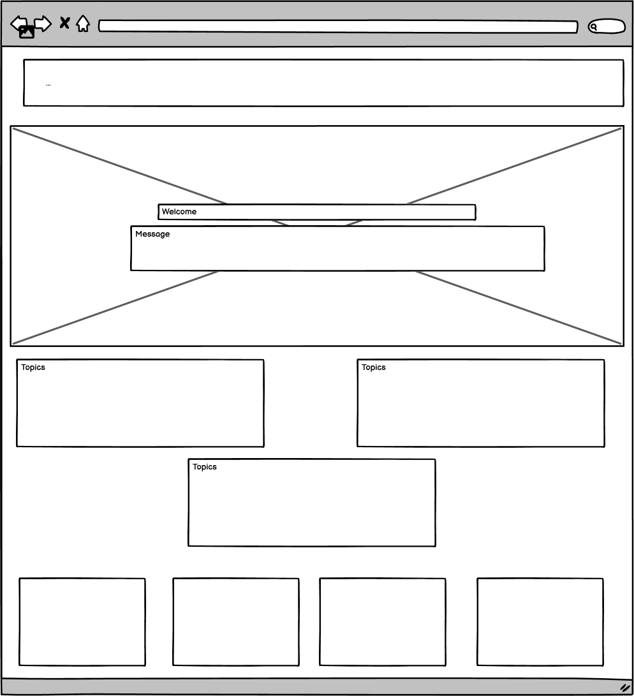
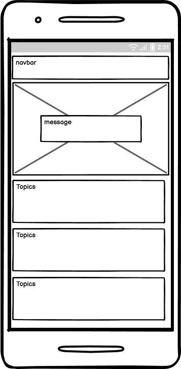

# Mental Health Awareness Project

## Description
Welcome to the Mental Health Awareness Project! This project aims to provide information, resources, and support to help individuals on their mental health journey. Our website includes sections on positive affirmations, external support resources, and a sign-up form for users to stay connected.

## Live site link
https://jamalholt18.github.io/p1-first-project/

## Table of Contents
- [Installation](#installation)
- [Usage](#usage)
- [Wireframe Designs](#wireframe-designs)
- [Contributing](#contributing)
- [License](#license)
- [Contact Information](#contact-information)

## Installation
To get started with the project, follow these steps:

1. Clone the repository:
    ```bash
    git clone https://github.com/yourusername/mental-health-awareness.git
    ```
2. Navigate to the project directory:
    ```bash
    cd mental-health-awareness
    ```
3. Open the project in your preferred code editor.

## Usage
1. **Home**: Welcome visitors to the site and introduce the purpose of the project.
2. **Positive Affirmations**: Display uplifting quotes and messages to encourage users.
3. **Support Resources**: Provide links to external mental health resources in a clean, organized grid layout.
4. **Sign-Up Form**: Collect user information to stay connected and provide updates.

## Wireframe Designs
Below are the wireframe designs for the project.




## User Stories

-As a user new to mental health resources, I want to see a hero section with a positive and encouraging message so that I feel welcome and motivated to explore the site.

-As a visitor seeking information on common mental health issues, I want to find easy-to-read information cards so that I can quickly understand and recognize symptoms and tips.

-As a user looking for additional support, I want to find a grid layout of resource links with standout buttons so that I can easily access external mental health resources.


## Contributing
We welcome contributions to enhance the project! To contribute:

1. Fork the repository.
2. Create a new branch:
    ```bash
    git checkout -b feature/your-feature-name
    ```
3. Commit your changes:
    ```bash
    git commit -m 'Add some feature'
    ```
4. Push to the branch:
    ```bash
    git push origin feature/your-feature-name
    ```
5. Open a pull request.

## License
This project is licensed under the MIT License. See the [LICENSE](LICENSE) file for more information.

## Contact Information
For any questions or feedback, please contact us at:
- Email: support@mentalhealthawareness.com
- Twitter: [@MentalHealthAwareness](https://twitter.com/MentalHealthAwareness)

---

_Project by Jamal Holt_
